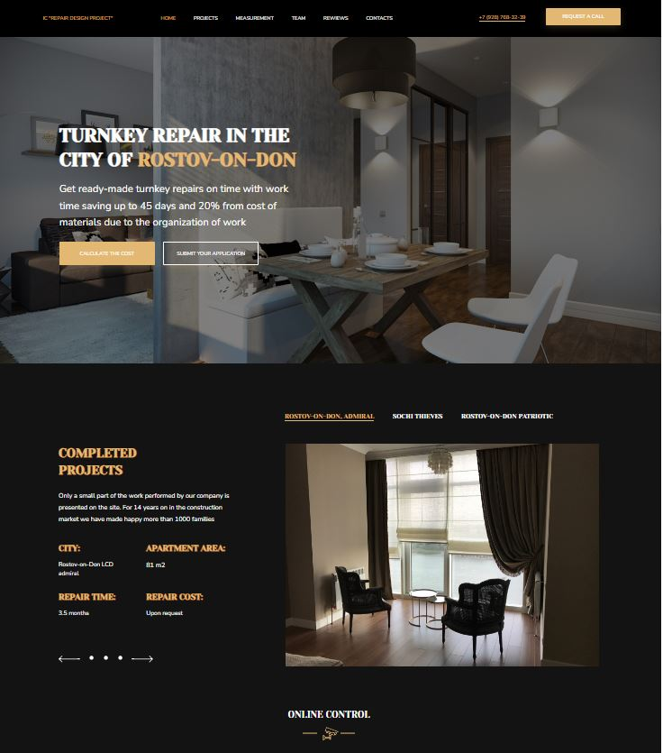

# Проект «Вёрстка лендинга по макету Фигма»/ Landing page project by Figma

Разработан в качестве практического задания на курсе "SkillFactory: PHPPRO
**Профессия Fullstack веб-разработчик на JavaScript и PHP**".
Сверстать для десктопной и мобильной версий одностраничный лендинг дизайнерского агентства
Макет вы сможете найти по <a href="https://www.figma.com/file/TdXgADLSbn7npH24qcjkAg/IC-Repair-Design-Project?node-id=0%3A1" target="_blank">ссылке</a>.

Completed as a practical task on the course "SkillFactory: PHPPRO"
**Profession Fullstack web developer in JavaScript and PHP**".
Landing page for a design agency, desktop and mobile versions
You can find the layout at the <a href="https://www.figma.com/file/TdXgADLSbn7npH24qcjkAg/IC-Repair-Design-Project?node-id=0%3A1" target="_blank">link</a>.

---

## Используемые технологии/Technologies used
* Figma
* HTML
* CSS
* СSS Flexbox
* СSS Grid

---
## Задача/Task

* максимальное совпадение с макетом по пискелям

* максимально оптимизированная версия

* использование технологий СSS Flexbox и СSS Grid 

* maximum match with the layout by pixels

* the most optimized version

* use of CSS Flexbox and CSS Grid technologies
---

Выполнено самостоятельно.
Done completely by myself.
---

На английском языке/En English

---
## Cкриншот/Screenshot

---

## Как запустить/How to run

Зайти в папку сайта в файловом менеджере, кликнуть 2 раза по файлу index.html./Go to the site folder in the file manager, double-click on the index.html file.

---

## Автор/Author
SofMik, начинающий веб-разработчик/SofMik, student web developer